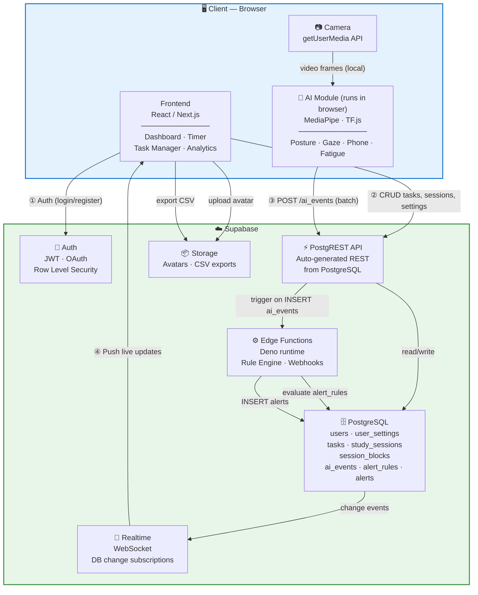

# 1️⃣ System Architecture Diagram

Tổng quan toàn bộ hệ thống: Frontend, Backend, Supabase, Camera AI và luồng dữ liệu.

## Data Flow tóm tắt

| # | Actor | → | Destination | Nội dung |
|---|-------|---|-------------|----------|
| ① | User | → | Supabase Auth | Đăng nhập / đăng ký |
| ② | Frontend | → | PostgREST API | CRUD tasks, sessions |
| ③ | AI Module | → | PostgREST API | Ghi ai_events hàng loạt |
| ④ | Realtime | → | Frontend | Push cập nhật alerts/session live |
| ⑤ | Edge Function | → | PostgreSQL | Đánh giá luật → tạo alerts |
