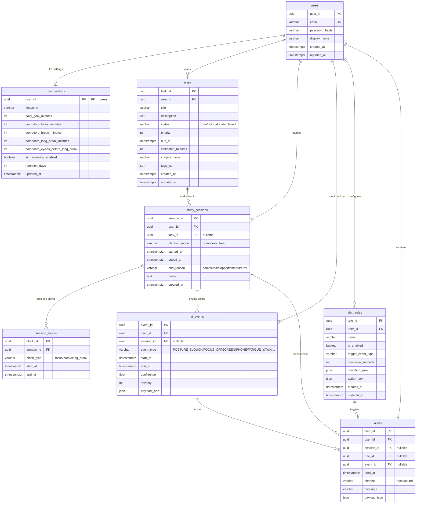

# 2️⃣ ERD — Entity Relationship Diagram

Source DBML: [`database/erd.dbml`](../../database/erd.dbml) — paste vào [dbdiagram.io](https://dbdiagram.io) để xem bản đẹp.

## Ghi chú indexes

| Bảng | Index |
|------|-------|
| `tasks` | `(user_id, status)`, `(user_id, due_at)` |
| `study_sessions` | `(user_id, started_at)`, `(task_id, started_at)` |
| `session_blocks` | `(session_id, start_at)` |
| `ai_events` | `(user_id, start_at)`, `(session_id, start_at)`, `(event_type, start_at)` |
| `alert_rules` | `(user_id, is_enabled)`, `(trigger_event_type)` |
| `alerts` | `(user_id, fired_at)`, `(session_id, fired_at)` |
