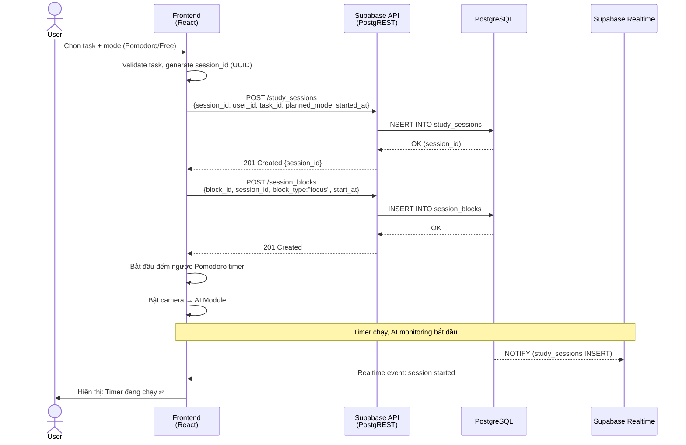
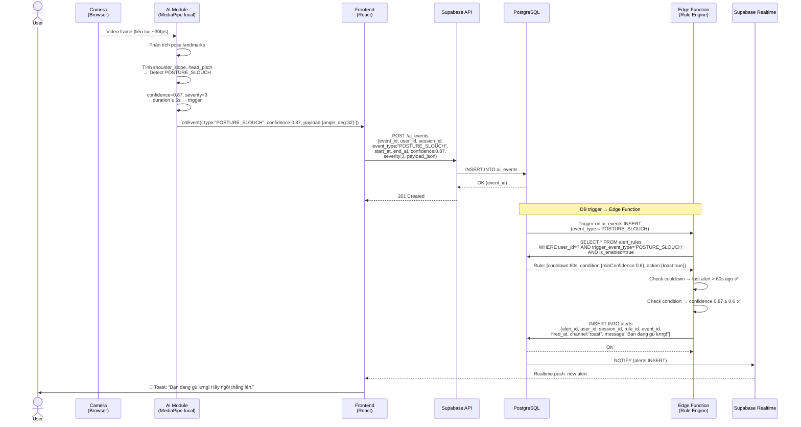

# 3️⃣ Sequence Diagrams

---

## Sequence 1 — Bắt đầu phiên học (Start Study Session)

```mermaid
sequenceDiagram
    actor User
    participant FE  as Frontend<br/>(React)
    participant SB  as Supabase API<br/>(PostgREST)
    participant DB  as PostgreSQL
    participant RT  as Supabase Realtime

    User->>FE: Chọn task + mode (Pomodoro/Free)
    FE->>FE: Validate task, generate session_id (UUID)

    FE->>SB: POST /study_sessions<br/>{session_id, user_id, task_id, planned_mode, started_at}
    SB->>DB: INSERT INTO study_sessions
    DB-->>SB: OK (session_id)
    SB-->>FE: 201 Created {session_id}

    FE->>SB: POST /session_blocks<br/>{block_id, session_id, block_type:"focus", start_at}
    SB->>DB: INSERT INTO session_blocks
    DB-->>SB: OK
    SB-->>FE: 201 Created

    FE->>FE: Bắt đầu đếm ngược Pomodoro timer
    FE->>FE: Bật camera → AI Module

    Note over FE,RT: Timer chạy, AI monitoring bắt đầu
    DB-->>RT: NOTIFY (study_sessions INSERT)
    RT-->>FE: Realtime event: session started

    FE->>User: Hiển thị: Timer đang chạy ✅
```

---

## Sequence 2 — AI phát hiện gù lưng → Bắn cảnh báo

```mermaid
sequenceDiagram
    actor User
    participant CAM  as Camera<br/>(Browser)
    participant AIM  as AI Module<br/>(MediaPipe local)
    participant FE   as Frontend<br/>(React)
    participant SB   as Supabase API
    participant DB   as PostgreSQL
    participant EDGE as Edge Function<br/>(Rule Engine)
    participant RT   as Supabase Realtime

    CAM->>AIM: Video frame (liên tục ~30fps)
    AIM->>AIM: Phân tích pose landmarks
    AIM->>AIM: Tính shoulder_slope, head_pitch<br/>→ Detect POSTURE_SLOUCH
    AIM->>AIM: confidence=0.87, severity=3<br/>duration ≥ 5s → trigger

    AIM->>FE: onEvent({ type:"POSTURE_SLOUCH", confidence:0.87, payload:{angle_deg:32} })

    FE->>SB: POST /ai_events<br/>{event_id, user_id, session_id,<br/>event_type:"POSTURE_SLOUCH",<br/>start_at, end_at, confidence:0.87,<br/>severity:3, payload_json}
    SB->>DB: INSERT INTO ai_events
    DB-->>SB: OK (event_id)
    SB-->>FE: 201 Created

    Note over DB,EDGE: DB trigger → Edge Function
    DB->>EDGE: Trigger on ai_events INSERT<br/>(event_type = POSTURE_SLOUCH)

    EDGE->>DB: SELECT * FROM alert_rules<br/>WHERE user_id=? AND trigger_event_type='POSTURE_SLOUCH'<br/>AND is_enabled=true
    DB-->>EDGE: Rule: {cooldown:60s, condition:{minConfidence:0.6}, action:{toast:true}}

    EDGE->>EDGE: Check cooldown → last alert > 60s ago ✅
    EDGE->>EDGE: Check condition → confidence 0.87 ≥ 0.6 ✅

    EDGE->>DB: INSERT INTO alerts<br/>{alert_id, user_id, session_id, rule_id, event_id,<br/>fired_at, channel:"toast", message:"Bạn đang gù lưng!"}
    DB-->>EDGE: OK

    DB->>RT: NOTIFY (alerts INSERT)
    RT-->>FE: Realtime push: new alert

    FE->>User: 🔔 Toast: "Bạn đang gù lưng! Hãy ngồi thẳng lên."
```
