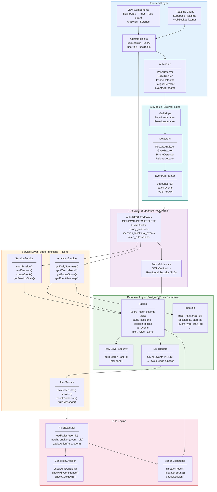

# 4️⃣ Component Diagram — Backend Architecture

Phân rã nội bộ backend/edge functions theo layer để tránh spaghetti code.

## Mô tả từng layer

| Layer | Trách nhiệm | Công nghệ |
|-------|-------------|-----------|
| **View Components** | UI render, user interaction | React / Next.js |
| **Custom Hooks** | State management, side effects | React Hooks + Supabase SDK |
| **AI Module** | Phân tích hình ảnh camera real-time | MediaPipe, TF.js |
| **EventAggregator** | Debounce + batch POST ai_events (tránh spam) | JavaScript |
| **API Layer** | REST endpoints, auth enforcement | Supabase PostgREST + RLS |
| **SessionService** | Lifecycle phiên học, tính toán blocks | Edge Function (Deno) |
| **AlertService** | Nhận event → gọi Rule Engine → tạo alert | Edge Function (Deno) |
| **AnalyticsService** | Tổng hợp số liệu theo ngày/tuần | Edge Function (Deno) |
| **Rule Engine** | Đánh giá điều kiện, cooldown, dispatch action | Edge Function (Deno) |
| **DB Layer** | PostgreSQL với RLS, indexes, triggers | Supabase PostgreSQL |
